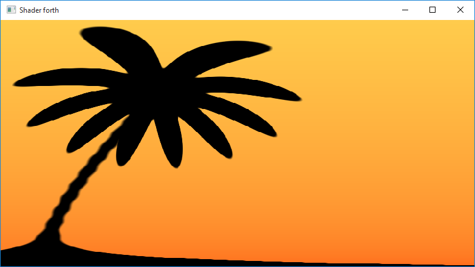
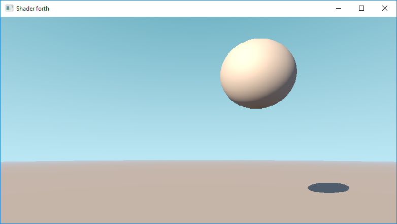
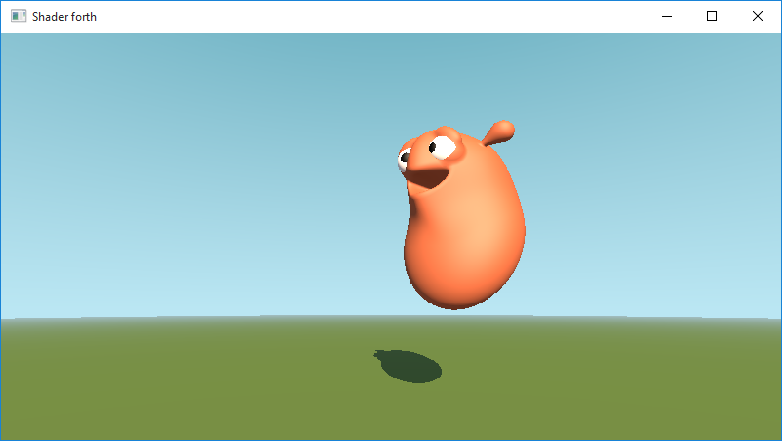
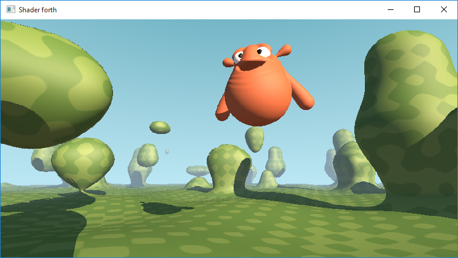

# vectorforth
SIMD vectorized Forth compiler with CPU based shader application

Vectorforth is a forth compiler that creates executable code, but every instruction is vectorized. For instance, if you compile `1 2 +`, then the result will obviously be `3`, but actually you will get 16 times the result `3` (using AVX-512), as each instruction is vectorized. The main toy application that I am interested in here is to see how fast your CPU can compute pixel shaders a la [ShaderToy](https://www.shadertoy.com). So we make use as much as possible of SIMD (i.e. vectorized) instructions and multithreading. Of course the CPU will not beat the GPU but it was fun to test how large the gap would be. 

## Building

Vectorforth has been tested on Windows 10 using Visual Studio 2017/2019, on Ubuntu 18.04.4 with gcc 7.5.0, and on MacOS 10.15.6 with XCode 11.7.
You best use CMake to generate a solution file or makefile or XCode project.

Vectorforth uses two CMake variables: VECTORFORTH_AVX512 and VECTORFORTH_SINCOS_METHOD.

  - If your computer can handle it, switch on VECTORFORTH_AVX512, as it will perform faster than AVX2. If your computer does not support AVX-512, and you switched VECTORFORTH_AVX512 on, the application will crash. Simply rebuild then with VECTORFORTH_AVX512 switched off.
  - Computation of sine and cosine can be (as good as) exact or approximate. This behaviour is controlled with variable VECTORFORTH_SINCOS_METHOD. If you want to see the shader examples, `approximate` is a good choice as it is faster, and the loss of accuracy is not visible in the shader images. If you want the highest accuracy for sine and cosine, then choose `vectorclass`.

Also of importance is your choice related to multithreading. This is controlled with the CMake variable JTK_THREADING. There are several choices here, but the best (fastest) choice is to use [Intel's TBB library](https://software.intel.com/content/www/us/en/develop/tools/threading-building-blocks.html). This requires some work though, as you will need to install TBB yourself first.

On Windows you can download TBB's binaries from its website, and install them, preferably, in 
folder C:\Program Files\TBB. Another folder is also possible, but then you'll need to
adapt the CMakeLists.txt file and make it point to the correct location.
On Ubuntu you can simply run 

    sudo apt install libtbb-dev 

to install TBB.
On MacOS you can run

    brew install tbb
    
If this gives an error in the sense of `Cannot write to /usr/local/Cellar` then you can solve this probably by updating your write privileges in this folder with the command `sudo chmod a+w /usr/local/Cellar`, and then try `brew` again.

If you don't want to use/install TBB, you can set JTK_THREADING to std, which will use std::thread instead.

The sample application shaderforth has a dependency on [SDL2](https://www.libsdl.org/download-2.0.php), which you'll need to install yourself (e.g. by downloading binaries or by downloading and building its source code).

The sample application sf has the same functionality as shaderforth (except for a lack of GUI), but does not depend on SDL2. So you can try the shaders without installing SDL2, only shaderforth will not compile in that case.

Other dependencies, which are delivered with the code, are
  - Agner Fog's vectorclass (https://github.com/vectorclass/version2)
  - ocornut's dear imgui (https://github.com/ocornut/imgui)
  - nlohmann's json (https://github.com/nlohmann/json)
  
## The shader

I've mainly used vectorforth as a test to see what the performance of a CPU is when you let it do embarrassingly parallel GPU tasks, such as writing a shader [(watch here)](https://youtu.be/X5ZvD8SHmVI). The most basic shader application is `sf` which has only a dependency on `TBB`. The other application is `shaderforth` which, apart from `TBB`, also depends on `SDL2` and `imgui`. Both `sf` and `shaderforth` have the same functionality, but `sf` is a command line tool, and `shaderforth` has a gui.

To run a shader you have to provide the shader code in vectorforth. There are some example vectorforth shaders in subfolder shaderforth/examples. One of the examples that is good to start with (`iq_tutorial.4th`) is based on a tutorial by Inigo Quilez ( see https://www.youtube.com/watch?v=0ifChJ0nJfM). The vectorforth code looks like:

    : qx u 0.33 - ;
    : qy v 0.7 - ;

    : dist-to-center qx dup * qy dup * + sqrt ;

    : r 0.2 0.1 qy qx atan2 10 * qx 20 * + 1 + cos * +;

    : factor r 0.01 r + dist-to-center smoothstep ;

    : r2 0.01 120 qy * cos 0.002 * + -40 v * exp +;

    : factor2 1 
          1 r2 0.01 r2 + qx 0.25 2 qy * sin * - abs smoothstep - 
          1 0 0.1 qy smoothstep - 
          * -  ;

    factor factor2 *
    dup dup
    0.4 0.8 v sqrt mix * swap
    0.1 0.3 v sqrt mix *

The shader generates the following image.

I've also reworked the tutorial by Inigo Quilez on the Happy Jumper shader (https://www.youtube.com/watch?v=Cfe5UQ-1L9Q) to vectorforth. Currently I've processed the first three steps in the tutorial, see scripts `sphere.4th`, `guy.4th`, and `guy2.4th` with corresponding images below. I'll probably not work through steps 4 and 5, as step 3 currently has 10 FPS on my pc, so steps 4/5 will be too slow on the CPU.

You can also [watch the video](https://youtu.be/X5ZvD8SHmVI) on YouTube.

The other examples in subfolder shaderforth/examples are mainly taken from the website https://forthsalon.appspot.com/. The author and link to the original shader are always mentioned in the `4th` script.

## Memory

The memory used by vectorforth is subdivided into 4 batches of memory that each have their own name:
  - the stack
  - the return stack
  - the binding space
  - the data space or heap
  
The return stack corresponds to the c stack, which, in assembler, is controlled by the rsp register.
The other memories are dynamically aligned on 32 bytes and they are sequential, like this:

\[   ... <== stack | variable space | data space ==> ...   \]

The stack is the workspace for vectorforth. Most operators pop or push values on this stack. The top of the stack resides at the end of the memory batch, as in the scheme above. Adding items on the stack moves the stack pointer to the left, i.e., the addresses have lower values in bytes. 

The data space is similar to the heap in c. With "allot" data space memory can be allocated and values can be stored here for later reference.

The binding space is used for binding words to data space locations. This memory is controlled by the compiler. With the "create \<name\>" keyword, the "variable <name>" keyword, or the "value <name>" keyword, the compiler will bind a given name to a data space address. Internally a dictionary is kept that binds \<name\> to a location in the binding space. This binding space location will point to the address in the data space memory where the memory was allocated. This means that the number of named variables/words is restricted by the size of binding space. For instance, if the binding space has size 2048 bytes, then 64 variables can be named ( 64 equals 2048 / 32 ).

## Glossary

### Core vectorforth

`: ;`    Define a new word with the syntax `: <word> <definition ...> ;`. Defined words are always inlined.

`@`    ( #a -- v )  Read the value v at 64-bit memory address #a and put it on the stack.

`!`    ( v #a -- )  Store value v in 64-bit memory address #a.

`+!`    ( v #a -- )  Add value v to the value in 64-bit memory address #a and store the result in #a.

`-!`    ( v #a -- )  Subtract value v from the value in 64-bit memory address #a and store the result in #a.

`*!`    ( v #a -- )  Multiply value v to the value in 64-bit memory address #a and store the result in #a.

`/!`    ( v #a -- )  Divide the value in 64-bit memory address #a by v and store the result in #a.

`(`    ( -- )  A multiline comment until the corresponding ).

`\`    ( -- )  A comment until the end of the line.

`+`    ( a b -- a+b )  Pop the top two values from the stack, and push their sum to the stack.

`-`    ( a b -- a-b )  Pop the top two values from the stack, and push their difference to the stack.

`*`    ( a b -- a\*b )  Pop the top two values from the stack, and push their multiplication to the stack.

`/`    ( a b -- a/b )  Pop the top two values from the stack, and push their quotient to the stack.

`=`    ( a b -- v ) 0xffffffff if the top elements are equal, else 0x00000000.

`<>`    ( a b -- v ) 0xffffffff if the top elements are not equal, else 0x00000000.

`<`    ( a b -- v ) 0xffffffff if a < b, else 0x00000000.

`>`    ( a b -- v ) 0xffffffff if a > b, else 0x00000000.

`<=`    ( a b -- v ) 0xffffffff if a <= b, else 0x00000000.

`>=`    ( a b -- v ) 0xffffffff if a >= b, else 0x00000000.

`,`    ( v -- )  Moves the top stack element to the address pointed to by the data space pointer, and updates the data space pointer so that it points to the next available location.

`abs`    ( a -- v )  Pop the top element of the stack, and put its absolute value on the stack.

`add2`    ( #a #b #r -- )  Adds two vec2 objects whose addresses are given by #a and #b. The result is saved at memory location #r.

`add3`    ( #a #b #r -- )  Adds two vec3 objects whose addresses are given by #a and #b. The result is saved at memory location #r.

`allot`    ( #u -- #a )  Allocates #u bytes of memory on the data space (heap). #u should always be a multiple of 32 for correct alignment with the simd addresses. The address of the memory allocated is pushed on the stack.

`and`    ( a b -- v )  bitwise and operator on a and b.

`atan2`    ( a b -- v )  Pop the top two elements of the stack and push the arctangent of a/b on the stack.

`begin <test> while <loop> repeat`     While loop. The loop is repeated until all vectorized values in the test return false. So it is possible that a vectorized value in the loop already is returning true in the test, but is still going through the loop, as other vectorized values are still returning false.

`ceil`    ( v -- v )  Round the top element of the stack upward.

`cells`    ( #n -- 32*#n)  Puts the size in bytes on the stack of #n cells as a 64-bit number.

`clamp`    ( c a b -- v )  Pops c a b off the stack. Pushes c if a < c and c < b, or a if c < a, or b if c > b on the stack.

`cos`    ( a -- v )  Pop the top element of the stack, and put its cosine on the stack.

`create <name>`    ( #a -- )  Creates a word <name> that returns the address #a.

`cross3`    ( #a #b #r -- )  Computes the cross product of the two vec3 objects whose addresses are given by #a and #b. The cross product is saved at memory location #r.

`depth`    ( -- #d )  Pushes the depth of the stack on the stack as a 64-bit integer.

`div`    ( a b -- quot )  Pop the top two elements a and b of the stack. Divide a by b, giving the floored quotient quot and the remainder rem. Put quot on the stack.

`div2`    ( #a #b #r -- )  Divides two vec2 objects componentwise whose addresses are given by #a and #b. The result is saved at memory location #r.

`div3`    ( #a #b #r -- )  Divides two vec3 objects componentwise whose addresses are given by #a and #b. The result is saved at memory location #r.

`dot2`    ( #a #b -- v )  Computes the dot product of the two vec2 objects whose addresses are given by #a and #b. The dot product is pushed on the stack.

`dot3`    ( #a #b -- v )  Computes the dot product of the two vec3 objects whose addresses are given by #a and #b. The dot product is pushed on the stack.

`drop`    ( v -- )  Pop the top element of the stack.

`2drop`    ( a b -- )  Pop the top two elements of the stack.

`dup`    ( v -- v v )  Duplicate the value on the top of the stack.

`2dup`    ( a b -- a b a b ) Duplicate the top two elements on the stack.

`exp`    ( a -- v )  Pop the top element of the stack, and put its exponential on the stack.

`f=`    ( a b -- v )  1.0 if the top elements are equal, else 0.0.

`f<>`    ( a b -- v )  1.0 if the top elements are not equal, else 0.0.

`f<`    ( a b -- v )  1.0 if a < b, else 0.0.

`f>`    ( a b -- v )  1.0 if a > b, else 0.0.

`f<=`    ( a b -- v )  1.0 if a <= b, else 0.0.

`f>=`    ( a b -- v )  1.0 if a >= b, else 0.0.

`false`    ( -- f )  Pushes false on the stack. False is a 256-bit number with all bits equal to 0.

`fcast`  ( #v -- v )  Pops the top item off the stack, treats this value as 8 vectorized 32-bit integers, casts them to float, and pushes the 8 vectorized float values on the stack.

`floor`    ( v -- v )  Round the top element of the stack downward.

`fm/mod`    ( a b -- rem quot )  Pop the top two elements a and b of the stack. Divide a by b, giving the floored quotient quot and the remainder rem. Put rem and quot on the stack.

`here`    ( -- #a )  Puts the 64-bit address of the data space (heap) pointer on the stack.

`icast`  ( v -- #v )  Pops the top item off the stack, treats this value as 8 vectorized 32-bit floats, casts them to a 32-bit integer, and pushes the 8 vectorized 32-bit integers on the stack.

`<test> if <true> else <false> then`    Conditional statement. The test value on the stack should equal 0xffffffff as true or 0x00000000 as false. The true and false branches should be balanced, meaning that both branches should add an equal amount of items on the stack, and any use of the return stack should be balanced. Furthermore it is not allowed in a branch to pop items off the stack that existed before the branch was initiated.

`length2`    ( #a -- )  Pushes the length of vec2 object with address #a on the stack.

`length3`    ( #a -- )  Pushes the length of vec3 object with address #a on the stack.

`log`    ( a -- v )  Pop the top element of the stack, and put its logarithm with base e on the stack.

`mat2x2 <name>`    ( -- )  Reserves 4 cells on the data space (heap) and binds \<name\> to this memory. 
    
`mat2x2!`    ( a b c d #v -- )  Moves values a, b, c, d to the address #v. Typicall #v is obtained by providing a mat2x2 word. The values are assumed to be in column-major order.

`mat3x3 <name>`    ( -- )  Reserves 9 cells on the data space (heap) and binds \<name\> to this memory.
    
`mat3x3!`    ( a1 ... a9 #v -- )  Moves values a1, a2, ..., a9 to the address #v. Typicall #v is obtained by providing a mat3x3 word. The values are assumed to be in column-major order.

`max`    ( a b -- v )  Select the larger value of the top two stack elements.

`min`    ( a b -- v )  Select the smaller value of the top two stack elements.

`mix`    ( x y a -- v )  Pops x y a off the stack. Pushes the glsl function mix(x, y, a) on the stack ( x * (1 - a) + y\*a ).

`mix2`    ( #x #y a #r -- )  Assumes #x #y and #r point to the address of a vec2. Computes #r = ( #x * (1 -a ) + #y\*a).

`mix3`    ( #x #y a #r -- )  Assumes #x #y and #r point to the address of a vec3. Computes #r = ( #x * (1 -a ) + #y\*a).

`mod`    ( a b -- rem )  Pop the top two elements a and b of the stack. Divide a by b, giving the floored quotient quot and the remainder rem. Put rem on the stack.

`mul2`    ( #a #b #r -- )  Multiplies two vec2 objects componentwise whose addresses are given by #a and #b. The result is saved at memory location #r.

`mul2x2`    ( #m #v #r -- )  Multiplies a mat2x2 object #m with a vec2 object #v. The result is saved at memory location #r.

`mul3`    ( #a #b #r -- )  Multiplies two vec3 objects componentwise whose addresses are given by #a and #b. The result is saved at memory location #r.

`mul3x3`    ( #m #v #r -- )  Multiplies a mat3x3 object #m with a vec3 object #v. The result is saved at memory location #r.

`negate`    ( a -- -a )  Pop the top element of the stack, and put its negative value on the stack.

`nip`    ( a b -- b )  Drop the first item below the top of the stack.

`normalize2`  ( #a #r -- )  Normalizes the vec2 object with address #a and saves the result at memory location #r.

`normalize3`  ( #a #r -- )  Normalizes the vec3 object with address #a and saves the result at memory location #r.

`not`    ( a -- v ) toggle all bits of a.

`or`    ( a b -- v ) bitwise or operator on a and b.

`over`    ( v w -- v w v )  Duplicate the element under the top stack element.

`pi`    ( -- 3.1415926535897 )  Puts pi on the stack.

`pick`    ( x_u ... x_1 x_0 #u -- x_u ... x_1 x_0 x_u )  Remove #u from the stack and copy x_u to the top of the stack.

`pop`   ( -- v )  Pop a value v from the return stack and push it on the regular stack.

`pow`    ( a b -- a^b )  Pop the top two elements of the stack, and push a to the power b on the stack.

`**`    ( a b -- a^b )  Pop the top two elements of the stack, and push a to the power b on the stack.

`push`   ( v -- )  Move a value v from the stack to the return stack.

`r>`   ( -- v )  Pop a value v from the return stack and push it on the regular stack.

`>r`   ( v -- )  Move a value v from the stack to the return stack.

`r@`    ( -- v )  Push a copy of the top value of the return stack on the regular stack.

`rdepth`    ( -- #d )  Pushes the depth of the return stack on the stack as a 64-bit integer.

`reflect3`    ( #i #n #r -- )  Assumes #i, #n and #r point to the address of a vec3. Computes #r = #i - 2 dot3(#n, #i) * #n.

`rot`    ( a b c -- b c a )  Rotate the top three elements on the stack.

`-rot`    ( a b c -- c a b )  Reverse rotate the top three elements on the stack.

`round`    ( v -- v )  Round the top element of the stack to the nearest integer.

`rp@`    ( -- #v ) Read the 64-bit address of the return stack pointer and put it on the stack.

`rt@`    ( -- #v ) Read the 64-bit address of the return stack top and put it on the stack.

`scalarmul2`    ( t #a #r -- )  Multiplies a vec2 object with address #a with a scalar t. The result is saved at memory location #r.

`scalarmul3`    ( t #a #r -- )  Multiplies a vec3 object with address #a with a scalar t. The result is saved at memory location #r.

`sdcapsule`    ( #p #a #b r -- d )  Computes the signed distance from vec3 #p to a line segment defined by vec3 #a and vec3 #b and radius r. (https://iquilezles.org/www/articles/distfunctions/distfunctions.htm)

`sdellipsoid`    ( #p #r -- d ) Computes the signed distance from vec3 #p to an origin centered ellipsoid with radii defined by vec3 #r.  (https://iquilezles.org/www/articles/distfunctions/distfunctions.htm)

`sdsphere`    ( #p r -- d )  Computes the signed distance from vec3 #p to an origin centered sphere with radius r.  (https://iquilezles.org/www/articles/distfunctions/distfunctions.htm)

`sdstick`    ( #p #a #b r1 r2 -- d )  Computes the signed distance from vec3 #p to a line segment defined by vec3 #a and vec3 #b and varying thickness going from radius r1 to radius r2. (https://iquilezles.org/www/articles/distfunctions/distfunctions.htm)

`sin`    ( a -- v )  Pop the top element of the stack, and put its sine on the stack.

`smax`     ( a b k -- v )  Polynomial smoothed maximum of values a and b with smoothness parameter k.

`smin`    ( a b k -- v )  Polynomial smoothed minimum of values a and b with smoothness parameter k.

`smoothstep`    ( a b x -- v )  Pops a b x off the stack. Pushes the glsl function smoothstep(a, b, x) on the stack.

`sp@`    ( -- #v ) Read the 64-bit address of the stack pointer and put it on the stack.

`sqrt`    ( a -- v )  Pop the top element of the stack, and put its square root on the stack.

`step`    ( edge x -- v )  Generates a step function by comparing x to edge. 0 is returned if x < edge, and 1 is returned otherwise. This is similar to f<=.

`st@`    ( -- #v ) Read the 64-bit address of the stack top and put it on the stack.

`sub2`    ( #a #b #r -- )  Subtracts two vec2 objects whose addresses are given by #a and #b. The result is saved at memory location #r.

`sub3`    ( #a #b #r -- )  Subtracts two vec3 objects whose addresses are given by #a and #b. The result is saved at memory location #r.

`swap`    ( v w -- w v ) Swap the top two elements on the stack.

`2swap`    ( a b c d --- c d a b )  Swap the top two pairs on the stack.

`tan`    ( a -- v )  Pop the top element of the stack, and put its tangent on the stack.

`to <name>`    ( v -- )  The word <name> should be the name of a value previously defined. The top value of the stack is popped, and its value is assigned to the value <name>.

`true`    ( -- t )  Pushes true on the stack. True is a 256-bit number with all bits equal to 1.

`trunc`    ( v -- v )  Truncate the top element of the stack (i.e. round towards zero).

`tuck`    ( a b -- b a b )  Copy the top stack item below the second stack item.

`value <name>`    ( v -- )  Pops the top value off the stack. Assigns this value to the word given by <name>.

`variable <name>`    ( -- )  Reserves/allocates 1 cell on the data space (heap). The address of this cell can be obtained by the provided name.

`vec2 <name>`    ( -- )  Reserves 2 cells on the data space (heap) and binds \<name\> to this memory.
    
`vec2!`    ( a b #v -- )  Moves values a, bc to the address #v. Typicall #v is obtained by providing a vec2 word.

`vec3 <name>`    ( -- )  Reserves 3 cells on the data space (heap) and binds \<name\> to this memory.
    
`vec3!`    ( a b c #v -- )  Moves values a, b, c to the address #v. Typicall #v is obtained by providing a vec3 word.

`v8 a b c d e f g h`    ( -- v ) Push a vectorized value on the stack with floating point values given by a,...,h.

`v8 #a #b #c #d #e #f #g #h`    ( -- v ) Push a vectorized value on the stack with 32-bit integer values given by #a,...,#h.

`within`    ( c a b -- <true|false> )  Returns true if a <= c and c < b, false otherwise.

`xor`    ( a b -- v ) bitwise xor operator on a and b.

`z*`    ( a b c d -- a\*c-b\*d a\*d+b\*c )  Pop the top four values from the stack, treat the pairs as complex numbers, and store their multiplication on the stack.

`z+`    ( a b c d -- a+c b+d )  Pop the top four values from the stack, treat the pairs as complex numbers, and store their sum on the stack.

`z-`    ( a b c d -- a-c b-d )  Pop the top four values from the stack, treat the pairs as complex numbers, and store their difference on the stack.

`#+`    ( #a #b -- #a+#b )  Pop two 64-bit addresses from the stack, and push their sum on the stack.

`#+!`    ( #v #a -- )  Assumes that 64-bit address #a points to another address, and adds 64-bit value #v to this address pointed to by #a. The top two elements on the stack are dropped.

`#-`    ( #a #b -- #a-#b )  Pop two 64-bit addresses from the stack, and push their difference on the stack.

`#-!`    ( #v #a -- )  Assumes that 64-bit address #a points to another address, and subtracts 64-bit value #v from this address pointed to by #a. The top two elements on the stack are dropped.

`#*`    ( #a #b -- #a*#b )  Pop two 64-bit addresses from the stack, and push their multiplication on the stack.

`#/`    ( #a #b -- #a*#b )  Pop two 64-bit addresses from the stack, and push their quotient on the stack.

`#<<`    ( #a #b -- #a<<#b )  Pop two 64-bit addresses from the stack, left-shift them, and put the result on the stack.

`#>>`    ( #a #b -- #a>>#b )  Pop two 64-bit addresses from the stack, right-shift them, and put the result on the stack.

`#1+`    ( #a -- #a+1)  Pop the top item (an address typically) from the stack and add one. Push the result on the stack.

`#1-`    ( #a -- #a-1)  Pop the top item (an address typically) from the stack and subtract one. Push the result on the stack.

`#32+`    ( #a -- #a+32)  Pop the top item (an address typically) from the stack and add 32. Push the result on the stack.

`#32-`    ( #a -- #a-32)  Pop the top item (an address typically) from the stack and subtract 32. Push the result on the stack.

`#64+`    ( #a -- #a+64)  Pop the top item (an address typically) from the stack and add 64. Push the result on the stack.

`#64-`    ( #a -- #a-64)  Pop the top item (an address typically) from the stack and subtract 64. Push the result on the stack.

`#96+`    ( #a -- #a+96)  Pop the top item (an address typically) from the stack and add 96. Push the result on the stack.

`#96-`    ( #a -- #a-96)  Pop the top item (an address typically) from the stack and subtract 96. Push the result on the stack.

`#128+`    ( #a -- #a+128)  Pop the top item (an address typically) from the stack and add 128. Push the result on the stack.

`#128-`    ( #a -- #a-128)  Pop the top item (an address typically) from the stack and subtract 128. Push the result on the stack.

`#160+`    ( #a -- #a+160)  Pop the top item (an address typically) from the stack and add 160. Push the result on the stack.

`#160-`    ( #a -- #a-160)  Pop the top item (an address typically) from the stack and subtract 160. Push the result on the stack.

`#192+`    ( #a -- #a+192)  Pop the top item (an address typically) from the stack and add 192. Push the result on the stack.

`#192-`    ( #a -- #a-192)  Pop the top item (an address typically) from the stack and subtract 192. Push the result on the stack.

`#224+`    ( #a -- #a+224)  Pop the top item (an address typically) from the stack and add 224. Push the result on the stack.

`#224-`    ( #a -- #a-224)  Pop the top item (an address typically) from the stack and subtract 224. Push the result on the stack.

`#256+`    ( #a -- #a+256)  Pop the top item (an address typically) from the stack and add 256. Push the result on the stack.

`#256-`    ( #a -- #a-256)  Pop the top item (an address typically) from the stack and subtract 256. Push the result on the stack.

### Specific shader forth definitions

`dt`    ( -- dt )  Put the change in time since the last frame in seconds on the stack.

`frame`    ( -- frame )  Put the frame index on the stack.

`mw`    ( -- mw )  Is negative my when a mouse button is pressed, otherwise positive my.  

`mx`    ( -- mx )  Put the mouse x-coordinate on the stack.
  
`my`    ( -- my )  Put the mouse y-coordinate on the stack.

`mz`    ( -- mz )  Is negative mx when a mouse button is pressed, otherwise positive mx.

`rx`   ( -- rx )  Put the x-component of the screen resolution on the stack.
  
`ry`   ( -- ry )  Put the y-component of the screen resolution on the stack.

`t`    ( -- t )  Put the current time in seconds since the start of the shader on the stack.

`u`    ( -- u )  Put the normalized (between 0 and 1) x-coordinate on the stack.
  
`v`    ( -- v )  Put the normalized (between 0 and 1) y-coordinate on the stack.
  
`x`    ( -- x )  Put the current x-coordinate on the stack.
    
`y`    ( -- y )  Put the current y-coordinate on the stack.
